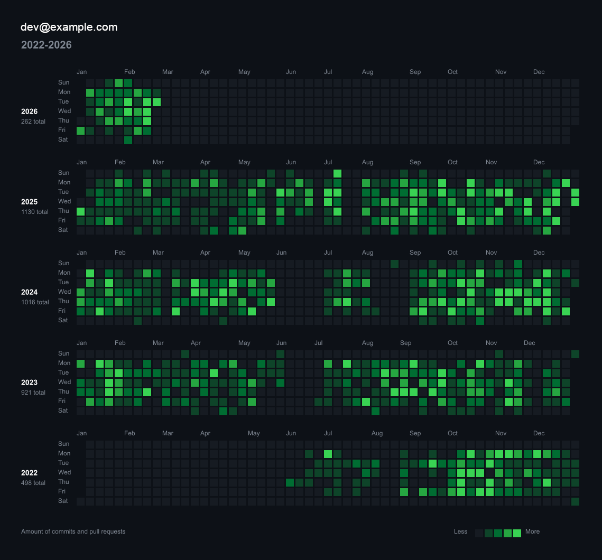

# Git Heatmap Generator

A C# .NET console application that generates a Git activity heatmap image (PNG) from a local Git repository.



## Features

- Scans one or **multiple local Git repositories** and aggregates the activity.
- Supports a **single year** or a **year range** (e.g., `2022...2026`).
- Supports different **color schemes** (e.g., Default, Blue, Red, Purple).
- Supports **Light and Dark modes** for all color schemes.
- Generates a visual Git contribution heatmap graph as **PNG** or **SVG**.
  - Multiple years are stacked vertically (newest on top) with year labels.
- Includes textual metadata on the image:
  - User email and year/range as the title.
  - Three-character month labels (Jan, Feb, Mar...) on the x-axis.
  - Three-character weekday labels (Sun, Mon, Tue...) on the y-axis.
  - Year labels on the left side of each year section.
  - "Amount of commits" label (or "Amount of commits and pull requests" if the flag is enabled).
- Renders a "Less — [Colors] — More" legend at the bottom right.

- Outputs the result as `heatmap_{year}.png` or `heatmap_{startYear}-{endYear}.png`.

## Prerequisites

- [.NET 10.0 SDK](https://dotnet.microsoft.com/download/dotnet/10.0) (or later)

## Dependencies

This project relies on the following NuGet packages:
- `LibGit2Sharp` - For interacting with and parsing the local Git repository history.
- `SixLabors.ImageSharp.Drawing` - For rendering the heatmap image grid and shapes.
- `SixLabors.Fonts` - For rendering text labels and titles onto the image.

## Third-Party Licenses

This project uses SixLabors.ImageSharp.Drawing and SixLabors.Fonts. While this project is Apache License Version 2.0, SixLabors.ImageSharp.Drawing and SixLabors.Fonts are governed by the Six Labors Split License.
Commercial users of this project should review Six Labors' [licensing terms](https://github.com/SixLabors/ImageSharp/blob/main/LICENSE) to ensure compliance.

## Installation

### Option 1: Global .NET Tool (Recommended)

You can install the application globally so it can be run from any directory as `git-heatmap`.

1.  **Pack the tool**:
    ```bash
    dotnet pack src/git_heatmap_generator -o ./nupkg
    ```
2.  **Install globally**:
    ```bash
    dotnet tool install --global --add-source ./nupkg git-heatmap-generator
    ```

Now you can run it directly:
```bash
git-heatmap --year 2025 --email dev@example.com --repo .
```

To update the tool later, run: `dotnet tool update --global --add-source ./nupkg git-heatmap-generator`.

### Option 2: Manual Binary Publication

If you prefer a standalone executable:

1.  **Publish the project**:
    ```bash
    dotnet publish src/git_heatmap_generator -c Release -r <RID> --self-contained true /p:PublishSingleFile=true
    ```
    *Replace `<RID>` with your platform:*
    *   **Windows**: `win-x64`
    *   **macOS (Intel)**: `osx-x64`
    *   **macOS (Apple Silicon)**: `osx-arm64`
    *   **Linux**: `linux-x64`

2.  **Add to Path**:
    *   **macOS/Linux**: Move the resulting binary to `/usr/local/bin` or add its folder to your `$PATH`.
    *   **Windows**: Add the folder containing the generated `.exe` to your System Environment Variables (PATH).


### Option 3: Docker

You can run the generator without having .NET installed locally using Docker.

1.  **Build the image**:
    ```bash
    docker build -t git-heatmap-generator .
    ```

2.  **Run the container**:
    You must mount your local repository and an output folder to the container.
    ```bash
    docker run -v /your/local/repo:/repo -v $(pwd):/out git-heatmap-generator --year 2025 --email user@mail.com --repo /repo --output /out
    ```

## Usage


You can run the application directly from the command line using the `dotnet run` command.

```bash
dotnet run --project src/git_heatmap_generator [options] -- [year] [email] <repository_path>
```

> **Note:** When using `dotnet run`, use `--` to pass flags to the application (e.g., `dotnet run -- --help`), otherwise `dotnet` will interpret them as its own flags.

### Options

| Flag | Description |
|------|-------------|
| `-r`, `--repo <path>` | Path to the local Git repository. |
| `-y`, `--year <year\|range>` | Year (e.g., `2025`) or range (e.g., `2022...2026`). Can be used multiple times. |
| `-e`, `--email <email>` | User email(s) (comma-separated or used multiple times). |
| `-o`, `--output <path>` | Output path or folder (e.g., `./out/test.png` or `./out/test.svg`). |
| `-f`, `--format <type>` | Output format: `png` (default), `svg`. |
| `-l`, `--layout <type>` | Layout for multi-year heatmaps: `vertical` (default), `horizontal`, or `separate`. |
| `-s`, `--style <name>` | Color style: `default` (default), `blue`, `red`, `purple`. |
| `-m`, `--mode <type>` | Background mode: `dark` (default), `light`. |
| `-pr`, `--pull-requests` | Include pull requests in the calculation. |
| `-h`, `--help` | Show help message. |

### Parameters

1. **`year`**: A single four-digit year (e.g., `2024`) or a year range using `...` (e.g., `2022...2026`).
2. **`email`**: One or more email addresses, comma-separated (e.g., `dev@example.com` or `dev@example.com,alt@example.com`). Commits matching any of the emails are combined.
3. **`repository_path`**: One or more local file paths to Git repositories. You can provide multiple paths as separate arguments or comma-separated.

### Examples

**Single year:**

```bash
dotnet run --project src/git_heatmap_generator 2026 dev@example.com ./my_awesome_project
```

This generates `heatmap_2026.png` with the activity for 2026.

**SVG format:**

```bash
dotnet run --project src/git_heatmap_generator --format svg 2026 dev@example.com ./my_awesome_project
```

This generates `heatmap_2026.svg` which is a scalable vector graphic.

**Year range:**

```bash
dotnet run --project src/git_heatmap_generator 2022...2026 dev@example.com ./my_awesome_project
```

This generates `heatmap_2022-2026.png` with each year stacked vertically (newest on top).

**Multiple repositories:**

```bash
dotnet run --project src/git_heatmap_generator 2025 dev@example.com ./project1 ./project2 ./project3
```

This aggregates activity from all three repositories into a single heatmap.

**Horizontal layout:**

```bash
dotnet run --project src/git_heatmap_generator 2022...2026 dev@example.com ./my_awesome_project -- --layout horizontal
```

This generates a single wide image with years side-by-side.

**Separate images:**

```bash
dotnet run --project src/git_heatmap_generator 2022...2026 dev@example.com ./my_awesome_project -- --layout separate
```

This generates individual PNG files for each year (e.g., `heatmap_2022.png`, `heatmap_2023.png`, etc.).

**Multiple emails:**

```bash
dotnet run --project src/git_heatmap_generator 2025 dev@example.com,alt@example.com ./my_awesome_project
```

This combines commits from both email addresses into a single heatmap.

**Light Mode:**

```bash
dotnet run --project src/git_heatmap_generator 2025 dev@example.com ./my_awesome_project -- --mode light
```

This generates a heatmap with a white background and light gray empty cells, suitable for light-themed documents.

**Using explicit flags:**

```bash
dotnet run --project src/git_heatmap_generator -- --year 2022...2026 --email user@example.com /path/to/repo --layout horizontal
```

**Custom output folder:**

```bash
dotnet run --project src/git_heatmap_generator 2025 dev@example.com ./my_awesome_project -o ~/Pictures
```

This saves the heatmap PNG to `~/Pictures/`.

**Specific filename:**

```bash
dotnet run --project src/git_heatmap_generator 2025 dev@example.com ./my_awesome_project -o my_stats.png
```

This saves the heatmap as `my_stats.png`.

## Testing

The project includes an xUnit test project to verify argument parsing, data aggregation, and rendering logic.

To run all tests from the root directory:

```bash
dotnet test
```

## Troubleshooting

- **"Invalid year or year range."**: Use a single year (e.g., `2025`) or a range with three dots (e.g., `2022...2026`).
- **"Invalid repository path: [path]"**: Ensure each provided path points to a valid Git repository containing a `.git` folder.
- **"Warning: No system fonts found."**: The application requires basic system fonts (like Arial or Helvetica) installed to render the text. If missing, the heatmap will generate without text labels.
